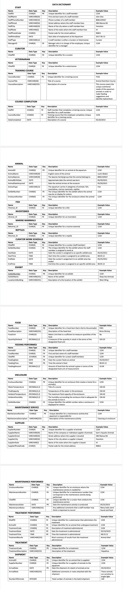

# Waikiki Aquarium Database

## Description

The Waikiki Aquarium, which started life as the Honolulu Aquarium, is the 2nd oldest public aquarium in the United States. It is located in Kapiolani Park in Honolulu, Hawaii. While the current Waikiki Aquarium building is small when compared to modern developments such as the Monterey Bay Aquarium, it has fairly a good selection of marine organisms. Because of the abundance of aquatic animals that the aquarium now contains, it requires a special kind of dedication to provide care to these animals. The aquarium has long stressed that the health of its aquatic animals it its primary concern. However, the aquarium’s staff have recently noticed many warning signs that their animals may be sick, including clamped fins, irregular behavior, losing weight, fading color, and floating. The aquarium thinks that this unusual behavior is due to the poor record keeping and information management among its staff members. To address this issue, the aquarium has decided to neglect using their daily “feeding, maintenance, and treatment” schedule that is printed out, carried, and shared among the employees and substitute it for a database that can be shared among its employees. As you can see, aquariums consist of several parts all working together to keep the fish alive and a database system will help make the staff’s job easier.

The database will contain information on the animals, the staff members, the enclosures the animals live in, and the services the staff members perform for the animals, in addition, the database will monitor the health of each individual animal.

First off, the database will contain information on each of the aquarium’s 10 staff members, including their name, phone number, and date of hire, and their full address (street, city, state, postal code). The aquarium employs two types of staff members – curators and veterinarians. A curator is a keeper or custodian of the aquarium that manages a certain portion of the aquarium’s animal collection. While a veterinarian is responsible for the healthcare program for the animal collection and the maintenance of health records.
Both are entered the same way into the database. Staff members will be entered into the database when hired, before undergoing their training. A staff member may manage up to as many staff members and each staff member may be managed by at most one other staff member.

Since all staff members must be able to recognize any abnormal behavior and clinical signs of illness, as well as understand the diets, and restraint procedures for the animals under their care, each newly hired staff member is required to complete a series of training courses, each designed to cover a different aspect required for the job, and is identified by a course number and described by a title and description. Since the aquarium continues to add different training courses, each training course may be taken by zero or many staff members. When a staff member completes a training course, this date is recorded.

Upon completing their training, a curator member is then assigned to work at a single exhibit area. When this assignment is made, the starting date, starting time, ending date, and ending time in which, the employee is responsible for managing that respective area is recorded. Each exhibit is denoted by a number and described by its name and location in the building. Each exhibit contains multiple tanks and all of the tanks regardless of their work center location, are treated the same way in terms of feeding and maintenance procedures. Since all of the aquarium’s habitat galleries and its quarantine facility are mutually exclusive, a tank belongs in a single work center. Each tank is identified by a tank number and described by its water temperature, fluid capacity, ambient temperature, and ambient humidity.

New animals are arriving at the aquarium frequently and are entered into the database upon arriving at the aquarium. Each animal is given a unique identification number, and described by a name, species group, approximate birth date, and the date acquired. Each animal is supplied by a single supplier and a supplier may supply zero or many animals. Every supplier that supplies animals to the aquarium it is identified by supplier number and described by the company’s name and address (street, state, city, postal code). The information of each shipment is recorded at the time the aquarium receives it, including the shipment’s arrival date, arrival note, and the number of animals in the batch.

Each animal has a different nutrition regime. An animal may never require food, while most need a single type of food to survive. A type of food can be shared and eaten by among multiple animals. Information regarding the type of food consumed by an animal includes a description of the food, a unit of measurement, and quantity on hand. Each time a curator feeds a tank of animals, the specific amount of food given as well as the date and time are recorded.

Since animals rely on their enclosure for their existence they must live in a single enclosure. Every enclosure at the aquarium is described by a number, the water temperature, fluid capacity, ambient temperature, and ambient humidity. An enclosure is home to one or many animals that can survive under the same conditions, thus it may contain multiple animals. While not all enclosures no on display for visitors yet, an enclosure may be displayed in at most a single exhibit. At least one animal is displayed in each exhibit.

A maintenance service is conducted for zero or more enclosures. Because there is a variety of maintenance services, a service is denoted by a unique number and description of the respective activity. A curator may never perform a maintenance service or perform many. When a curator conducts a maintenance service for an enclosure, the date and any additional notes are recorded.

If any of the animals appear to be diseased, injured, or stressed a curator is responsible for reporting them promptly to a veterinarian so that they can be treated. The details of each Treatment type are stored and include a treatment code and a description. The date and time of the treatment and their results of it is recorded when an animal undergoes a treatment procedure by a veterinarian and a full description of the examination results.

## Mock-Up

## Databse Diagrams

1. The Entity Relationship Diagram:
   

2. The Relational Database Schema:
   

## Data Dictionary

To View the Data Dictionary: 

#### I created 4 views with justifications for each in the [Create_Views.sql](Create_Views.sql):

1. The first view will be useful for curators to look at to check the time interval between the last time each animal was fed. This view also filters out the feeding time for the day so that curators can check the feeding tracker daily and not have to filter throughout a variety of date and time entries.
2. Second, similarly to the above view, this view will be useful for curators as well. They will be able to filter the maintenance services performed within the current year and also see the time to date since the last service was performed.
3. The third view will be helpful to curators to be able to see which animals are not on display in an exhibit. Animals may not be on display for two reasons – they have just arrived at the aquarium and they have not yet been assigned an exhibit yet, or they are diseased or sick are being treated in the quarantine enclosure by the veterinarians.
4. The fourth view will be helpful to both curators and veterinarians to be able to easily see the number of animals located in each enclosure. This not only helps the curators assign animals to different enclosures ensuring that the enclosures are not overpopulated but it also helps the veterinarians check how many animals are under their care to give everyone a clear picture of the aquariums health.

## License

